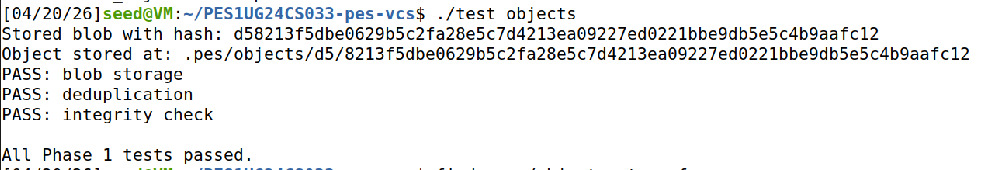
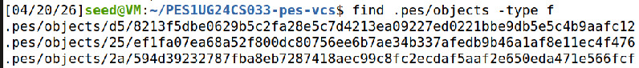
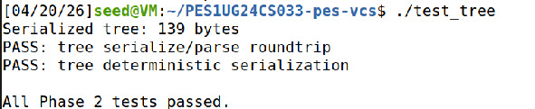
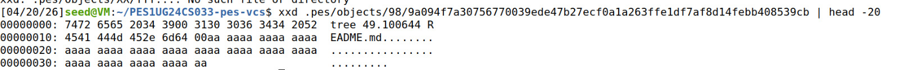
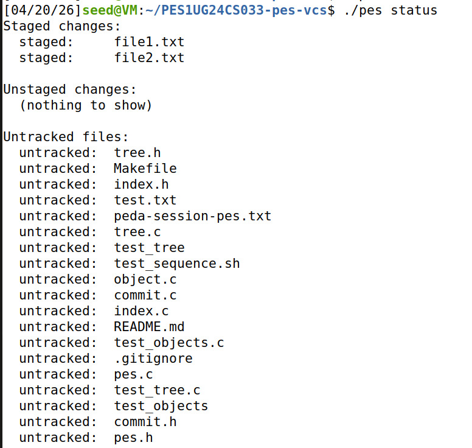
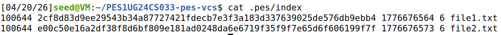
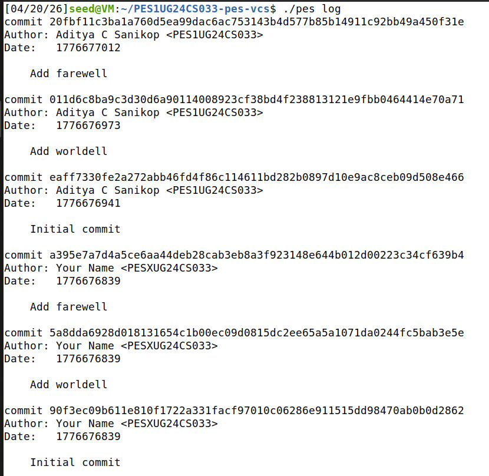
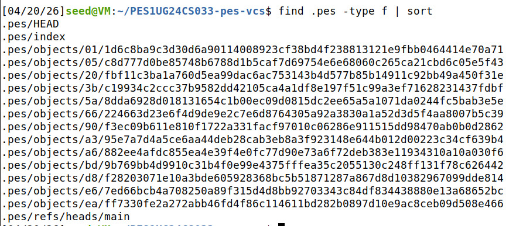
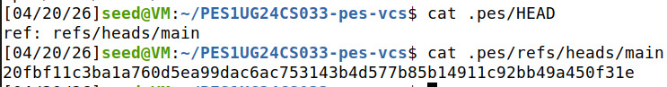

# PES-VCS Lab Report

---

## Screenshots

### Phase 1: Object Storage

**Screenshot 1A** — `./test_objects` output showing all tests passing:

**Screenshot 1B** — `find .pes/objects -type f` showing sharded directory structure:

### Phase 2: Tree Objects

**Screenshot 2A** — `./test_tree` output showing all tests passing:

**Screenshot 2B** — `xxd` of a raw tree object (first 20 lines):

### Phase 3: Staging Area

**Screenshot 3A** — `pes init` → `pes add` → `pes status` sequence:

**Screenshot 3B** — `cat .pes/index` showing the text-format index:

### Phase 4: Commits and History

**Screenshot 4A** — `pes log` output with three commits:

**Screenshot 4B** — `find .pes -type f | sort` showing object store growth:

**Screenshot 4C** — `cat .pes/refs/heads/main` and `cat .pes/HEAD` showing the reference chain:

### Integration Test

**Final** — Full integration test (`make test-integration`):

---

## Phase 5 & 6: Analysis Questions

### Q5.1: Implementing `pes checkout <branch>`

To implement `pes checkout <branch>`, the following changes are needed:

**Files that change in `.pes/`:**
- `.pes/HEAD` is updated to contain `ref: refs/heads/<branch>`, pointing to the new branch.

**Working directory changes:**
1. Read the commit hash from `.pes/refs/heads/<branch>`.
2. Read the commit object to get its root tree hash.
3. Recursively walk the tree object, reading each blob, and write the file contents to the working directory at the correct paths.
4. Update `.pes/index` to reflect the checked-out tree so that `pes status` shows a clean state.

**What makes this complex:**
- Files present in the current branch but absent in the target branch must be deleted from the working directory.
- Files present in the target branch but absent in the current branch must be created.
- If the user has uncommitted modifications to tracked files that also differ between branches, checkout must abort to avoid data loss. Detecting this requires comparing the working directory state against both the current index and the target tree.
- Directory creation and removal adds further edge cases (e.g., removing the last file in a directory should remove the directory).

### Q5.2: Detecting Dirty Working Directory Conflicts

To detect whether checkout is safe, compare three versions of each tracked file using only the index and object store:

1. **Index vs. HEAD tree:** For each file in the index, compare its stored blob hash against the blob hash in the current HEAD commit's tree. If they differ, the file has staged changes that would be lost.

2. **Working directory vs. Index:** For each file in the index, `stat()` the working file and compare `mtime` and `size` against the index entry. If they differ, the file has unstaged modifications. To be certain, re-read and re-hash the file contents and compare against the index blob hash.

3. **Target tree vs. HEAD tree:** For each file that differs between the current HEAD tree and the target branch's tree, check if that file is dirty (from steps 1 or 2). If a file is both dirty and differs between branches, checkout must refuse — otherwise the user's modifications would be silently overwritten.

Files that are identical between both branches can be safely ignored even if dirty, since checkout would not change them. Files that are untracked (not in the index) are also safe unless the target tree introduces a file with the same name, which would cause a conflict.

### Q5.3: Detached HEAD and Recovering Commits

In detached HEAD state, `.pes/HEAD` contains a raw commit hash (e.g., `a1b2c3d4...`) instead of a symbolic reference (e.g., `ref: refs/heads/main`).

**What happens when you commit in this state:**
- New commits are created normally. Each new commit's parent points to the previous commit.
- However, `head_update` writes the new commit hash directly into `.pes/HEAD` (since there is no branch ref to update).
- No branch file in `.pes/refs/heads/` is updated, so no branch tracks these commits.

**The danger:**
- If the user checks out a branch (e.g., `pes checkout main`), HEAD is overwritten to point to that branch. The commits made in detached HEAD state are now **orphaned** — no reference points to them. They still exist in the object store but are unreachable by walking any branch.

**Recovery:**
- If the user remembers (or recorded) the commit hash, they can directly check it out or create a branch pointing to it: `git branch recovery-branch <hash>`.
- Git provides `git reflog`, which logs every change to HEAD, allowing users to find the orphaned commit hash. PES-VCS does not have a reflog, so without the hash these commits would eventually be lost to garbage collection.

### Q6.1: Garbage Collection Algorithm

**Algorithm to find and delete unreachable objects:**

1. **Mark phase** — Build a set of all reachable object hashes:
   - Start from every branch tip: read all files in `.pes/refs/heads/` to get commit hashes.
   - For each commit, mark it as reachable, then:
     - Read the commit object, mark its tree hash as reachable.
     - Recursively walk the tree: mark every subtree and blob hash as reachable.
     - Follow the parent pointer and repeat until reaching a root commit (no parent).
   - Use a **hash set** (e.g., a hash table keyed by ObjectID) to track reachable hashes. This gives O(1) lookup and insertion.

2. **Sweep phase** — Walk the entire `.pes/objects/` directory:
   - For each object file, reconstruct its hash from the shard directory name + filename.
   - If the hash is **not** in the reachable set, delete the file.
   - Remove empty shard directories afterward.

**Estimation for 100,000 commits and 50 branches:**
- **Commits visited:** Each branch walks its history, but commits shared between branches are visited only once (the hash set deduplicates). In the worst case (completely disjoint histories), this is 100,000 commit objects. In practice with shared ancestry, it is fewer.
- **Trees and blobs:** Each commit points to one root tree. If each tree has ~50 entries on average, and there are ~100,000 unique trees, that is ~5,000,000 tree entry lookups. With deduplication (shared blobs across commits), the unique reachable objects are likely in the range of **200,000–500,000** total objects to visit.
- The hash set keeps memory usage proportional to the number of unique reachable objects (each entry is 32 bytes for SHA-256), so roughly 6–16 MB for this scale.

### Q6.2: Race Condition Between GC and Concurrent Commit

**Why concurrent GC and commit is dangerous:**

Consider this timeline with two concurrent processes:

| Time | Commit process | GC process |
|------|---------------|------------|
| T1 | Writes blob `B1` to object store | |
| T2 | Writes tree `T1` referencing `B1` | |
| T3 | | Starts mark phase — walks all reachable refs |
| T4 | | Mark phase completes. `B1` and `T1` are **not** reachable yet (commit object hasn't been written, branch ref hasn't been updated) |
| T5 | Writes commit `C1` referencing `T1` | |
| T6 | | Sweep phase: deletes `B1` and `T1` as unreachable |
| T7 | Updates `refs/heads/main` → `C1` | |

Now `C1` is the HEAD commit, but its tree `T1` and blob `B1` have been deleted. The repository is **corrupted** — `pes log`, `pes checkout`, and any operation that reads this commit will fail with missing object errors.

**How Git's real GC avoids this:**

1. **Grace period:** `git gc` only deletes unreachable objects that are older than a configurable threshold (default: 2 weeks, controlled by `gc.pruneExpire`). Newly created objects during a concurrent commit will be recent and therefore survive the sweep even if momentarily unreachable.

2. **Lock files:** Git uses `.git/gc.pid` lock files to prevent multiple GC processes from running simultaneously.

3. **Reachability from all refs + reflogs:** Git's mark phase also traverses the reflog, which records recent HEAD changes. This means even recently dereferenced commits (and their trees/blobs) remain reachable during GC.

4. **Two-phase approach:** In practice, `git gc` first repacks objects into packfiles and only then prunes loose objects, reducing the window for races.